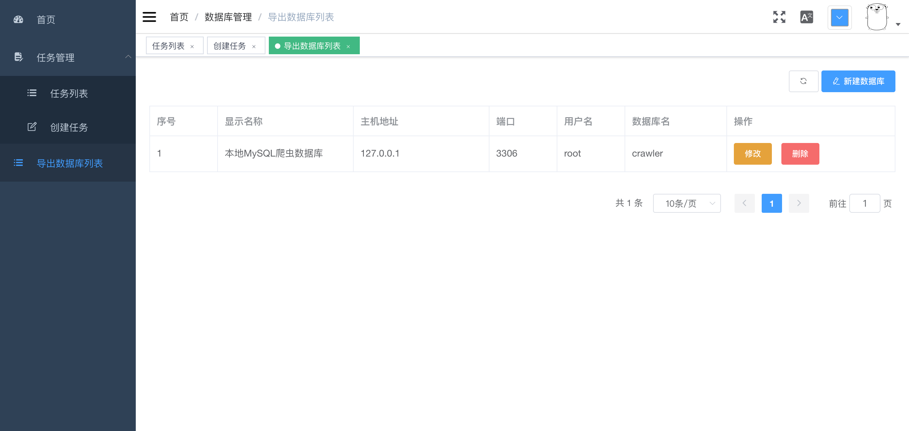
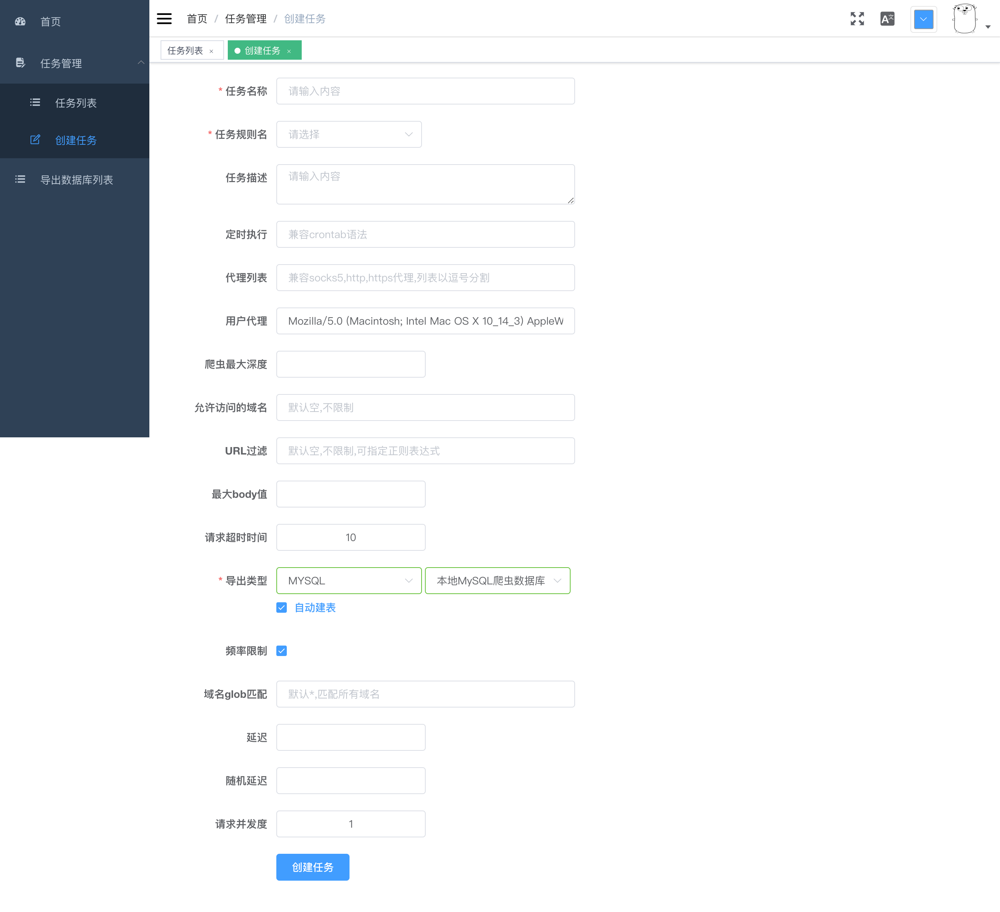
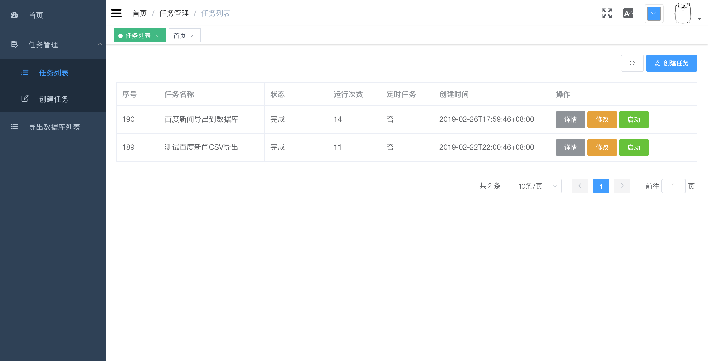

[](https://godoc.org/github.com/mybee/gospider)
[](https://travis-ci.org/mybee/gospider)
[](https://goreportcard.com/report/github.com/mybee/gospider)
[](https://codecov.io/github/mybee/gospider)
[](https://app.fossa.com/projects/git%2Bgithub.com%2Fnange%2Fgospider?ref=badge_shield)


# gospider
golang实现的爬虫框架，使用者只需关心页面规则，提供web管理界面。基于[colly](https://github.com/gocolly/colly)开发。


## 当前状态
Alpha, 核心功能可用, 但功能还不完善。接口随时可能改变。

限制: 
* 目前只能单机运行, 不能实现真正的分布式运行。 但大部分情况下, 如果你不是需要同时爬取成百上千个站点, 其实并不需要真正的分布式, 
只需要一个代理IP池即可。
* 不能用于大文件下载


## 特性
* 使用者只需编写页面规则代码
* 提供WEB管理界面 (包括任务管理、系统管理等)
* 任务级别的可配置异步并发控制(请求延迟, 请求并发度)
* 自动cookie和session处理
* 支持各种导出类型(mysql,csv等)
* 支持定时任务(兼容crontab格式)
* 支持任务级别的可配置代理IP池
* Robots.txt 支持

## 依赖
MySQL

gospider可以配置一下相关环境变量: 
GOSPIDER_DB_HOST、GOSPIDER_DB_PORT、GOSPIDER_DB_USER、GOSPIDER_DB_PASSWORD、GOSPIDER_DB_NAME、GOSPIDER_WEB_IP、GOSPIDER_WEB_PORT

本地开发环境: [安装](https://github.com/mybee/go-spider/wiki/Install)

## 使用方式
`_example` 目录提供了使用实例, rule目录里面包含了爬取规则, 编译成功后直接运行。在浏览器打开: http://localhost:8080/admin

以baidunews(百度新闻)为例简单说明爬虫规则如何编写:
```go
package baidunews

import (
	"github.com/mybee/go-spider/spider"
	log "github.com/sirupsen/logrus"
)

func init() {
	spider.Register(rule)   // 注册规则
}

var rule = &spider.TaskRule{
	Name:         "百度新闻规则",     // 规则名称
	Description:  "抓取百度新闻各个分类的最新焦点新闻",  // 规则描述
	Namespace:    "baidu_news",     // 命名空间, 选择导出类型时有用, 比如导出类型为MySQL时, namespace相当于表明
	OutputFields: []string{"category", "title", "link"},    // 导出字段
	Rule: &spider.Rule{     // 规则详细定义
		Head: func(ctx *spider.Context) error {     // 规则就像是一个链表, head为头节点, 后续为node节点, head节点的处理应该足够简单, 比如定义入口链接, 处理登陆等
			return ctx.VisitForNext("http://news.baidu.com")
		},
		Nodes: map[int]*spider.Node{    // nodes定义了一系列的实际业务的处理步骤, 一个复杂的业务可以被分为多个连续的子任务, key从0开始递增
			0: step1, // 第一步: 获取所有分类
			1: step2, // 第二步: 获取每个分类的新闻标题链接
		},
	},
}

var step1 = &spider.Node{ 
    OnRequest: func(ctx *spider.Context, req *spider.Request) { // 实际请求发出之前执行
        log.Println("Visting", req.URL.String())
    },
    OnHTML: map[string]func(*spider.Context, *spider.HTMLElement) error {  // 返回结果是html时执行, map的key为页面选择器(和jquery的选择器语法相同)
        `.menu-list a`: func(ctx *spider.Context, el *spider.HTMLElement) error { // 获取所有分类
            category := el.Text
            if category == "首页" {
                category = "热点要闻"
            }

            ctx.PutReqContextValue("category", category)     // 在请求的context中存储key,value值(通常用于需要传递参数到下一个处理流程时使用)

            link := el.Attr("href")
            return ctx.VisitForNextWithContext(link)    // 定义下一个处理流程的入口, 并且保留context上下文
        },
    },
}

var step2 = &spider.Node{ 
    OnRequest: func(ctx *spider.Context, req *spider.Request) {
        log.Println("Visting", req.URL.String())
    },
    OnHTML: map[string]func(*spider.Context, *spider.HTMLElement) error {
        `#col_focus a, .focal-news a, .auto-col-focus a, .l-common .fn-c a`: func(ctx *spider.Context, el *spider.HTMLElement) error {
            title := el.Text
            link := el.Attr("href")
            if title == "" || link == "javascript:void(0);" {
                return nil
            }
            category := ctx.GetReqContextValue("category")      // 取出上一步context中存储的值
            return ctx.Output(map[int]interface{}{    // 导出字段, key从0递增, 很上面的OutputFields内容需要一一对应
                0: category,
                1: title,
                2: link,
            })
        },
    },
}

```
完整的使用方式请参考`_example`目录。 运行成功后打开WEB界面效果:






## 感谢
* [colly](https://github.com/gocolly/colly)
* [gin](https://github.com/gin-gonic/gin)
* [gorm](https://github.com/jinzhu/gorm)


## License
[](https://app.fossa.io/projects/git%2Bgithub.com%2Fnange%2Fgospider?ref=badge_large)